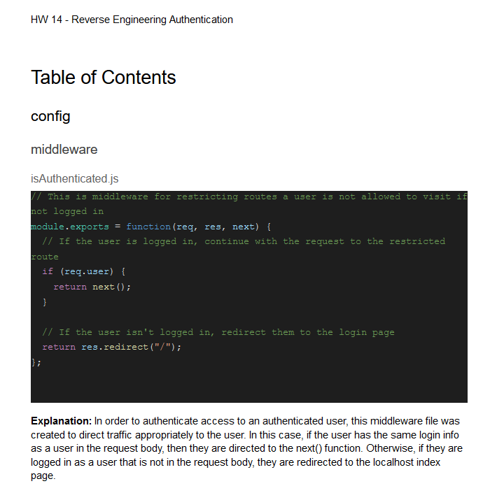

# Selma's HW14 Reverse Engineering Authentication

## Description:

In this activity, I am building a detailed user guide on how to traverse the code in the 'Develop' folder of this sample code.

## Installation:

- If you need to pull my code for this homework, please visit my Github repository at: https://github.com/selma-e/Reverse_Engineering_Authentication
- If you want to see the google document tutorial, please visit here: https://docs.google.com/document/d/1WzRN3X8k47YuoFhK2izzDyWvkYyZSiytLDCCCs-u_-o/edit?usp=sharing

## Usage:

## Resources Used/Credits:

- https://www.google.com/docs/about/

© 2020 Selma Elgabalawy | UW-SEA-FSF-PT-08-2020-U-C-TTh
